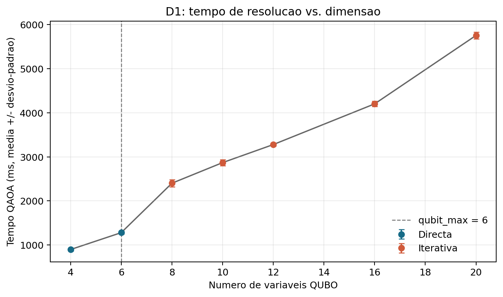
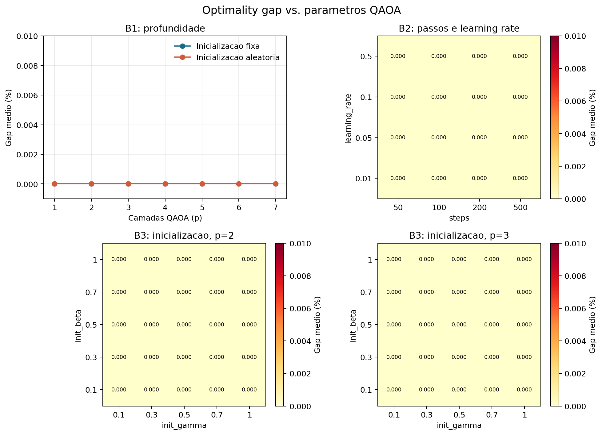
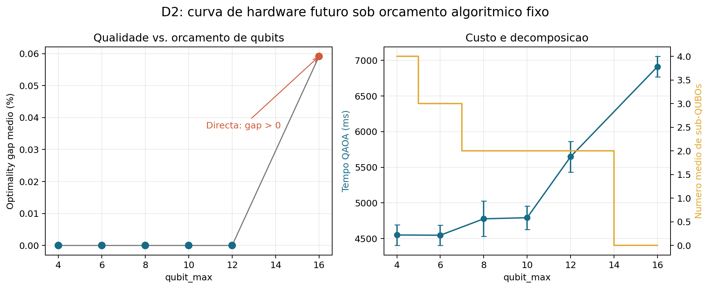
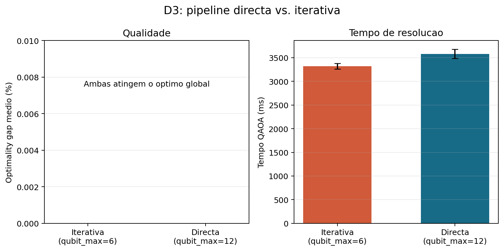
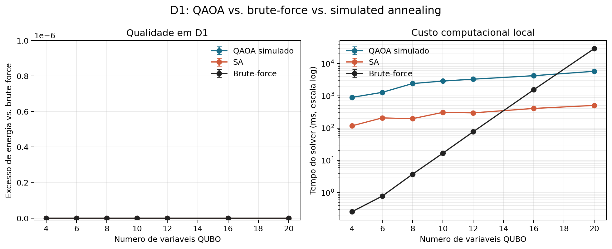
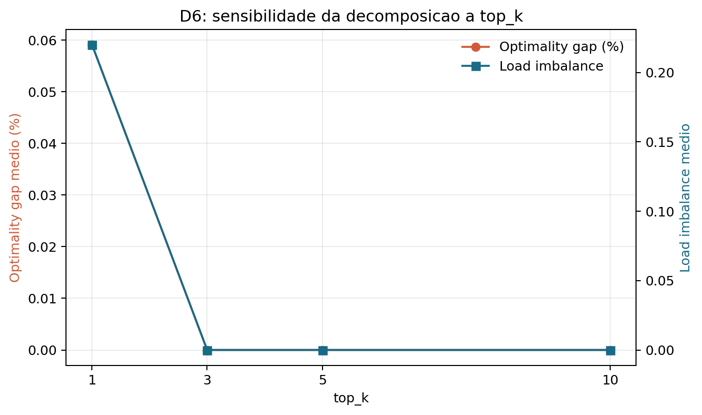

# Resultados finais da Fase 3

Data: 2026-06-27

## Ambito e proveniencia

Esta fase consolida os resultados das fases 1 e 2, produz tabelas e figuras curadas por experiencia e acrescenta os baselines que faltavam para D1. Foram integradas 433 execucoes sinteticas/deterministicas e uma execucao live de diagnostico. Todas as 434 execucoes terminaram com sucesso e produziram atribuicoes one-hot viaveis; entre as 433 execucoes com brute-force disponivel, 423 atingiram o optimo global (97.69%).

Os dez casos suboptimos estao concentrados em dois pontos: cinco repeticoes de D2 com `qubit_max=16` e cinco repeticoes de D6 com `top_k=1`. A execucao live tem 26 variaveis, acima do limite de 22 do brute-force, pelo que e comparada apenas com simulated annealing (SA) e nao e classificada como optima.

## Artefactos finais

- Tabela por execucao: `src/experiments/results/analysis_20260627_phase3/phase3_runs.csv`
- Tabela agregada por configuracao: `src/experiments/results/analysis_20260627_phase3/phase3_summary.csv`
- Baselines D1 em formato longo: `src/experiments/results/analysis_20260627_phase3/d1_solver_baselines.csv`
- Manifesto de fontes, contagens e sementes: `src/experiments/results/analysis_20260627_phase3/manifest.json`
- Script reprodutivel: `src/experiments/phase3_analysis.py`
- Resultado live: `src/experiments/results/run_20260627_142003_9cb1a45d_results.jsonl`

O baseline SA de D1 foi repetido com as sementes 101, 102, 103, 104 e 105. O brute-force foi recalculado uma vez por dimensao e a energia foi verificada contra o optimo guardado nos JSONL originais.

## Cobertura experimental

| Experiencia | Runs | Viaveis | Optimos globais | Resultado principal |
|---|---:|---:|---:|---|
| A / T1 | 3 | 3/3 | 3/3 | Sanidade directa confirmada |
| B1 fixo + aleatorio | 70 | 70/70 | 70/70 | `p=1` ja satura a qualidade |
| B2 | 80 | 80/80 | 80/80 | 50 passos bastam nesta instancia |
| B3 | 50 | 50/50 | 50/50 | Grelha gamma/beta sem minimo local observavel |
| B4 X + XY | 60 | 60/60 | 60/60 | Ambos estaveis; instancia pouco adversarial |
| C1 | 25 | 25/25 | 25/25 | Sem falha entre 0.25 e 4 vezes `P_safe` |
| C2 | 40 | 40/40 | 40/40 | `P_safe` robusto nas amostras uniformes/Pareto |
| D1 | 35 | 35/35 | 35/35 | Decomposicao mantem qualidade ate N=10 |
| D2 | 30 | 30/30 | 25/30 | **Anomalia em `qubit_max=16`** |
| D3 | 10 | 10/10 | 10/10 | Directa e iterativa empatam em qualidade |
| D4 | 10 | 10/10 | 10/10 | Estrategias implementadas empatam |
| D5 | 0 | - | - | Caminho sintetico nao activa clustering adaptativo |
| D6 | 20 | 20/20 | 15/20 | **`top_k=1` e consistentemente suboptimo** |
| E / T5.1 live | 1 | 1/1 | Nao certificavel | Integracao live confirmada; empate com SA |

## Figuras principais

### Escalabilidade temporal



Em D1, o tempo medio do solver cresce de 896 ms para quatro variaveis para 5756 ms para vinte variaveis. A mudanca para a pipeline iterativa ocorre acima de seis variaveis e acrescenta resolucoes sequenciais de sub-QUBOs. Estes tempos correspondem a simulacao PennyLane local, nao a hardware quantico.

### Parametros QAOA



Todos os pontos B1, B2 e B3 apresentam gap zero na instancia de referencia. A figura e, portanto, evidencia de saturacao do benchmark e nao de insensibilidade universal dos parametros. O custo temporal e a convergencia operacional, discutidos abaixo, continuam a distinguir configuracoes.

### Qualidade vs qubit_max



Os casos decompostos com `qubit_max` entre 4 e 12 atingem o optimo global. O caso directo com `qubit_max=16` tem gap relativo 0.0005913 (0.05913%) e energia -40.9006 contra -40.9248 do brute-force. Este ponto contradiz uma leitura monotonicamente favoravel a mais qubits quando `p=2` e 100 passos permanecem fixos.

### Pipeline directa vs iterativa



Na zona de sobreposicao D3, ambas as pipelines atingem energia -31.125 e gap zero. A iterativa demora em media 3321 ms e a directa 3582 ms, mas uma unica instancia nao permite concluir vantagem temporal. O resultado isola, contudo, um caso em que a decomposicao nao degrada a qualidade global.

### QAOA vs brute-force vs SA



Nas sete workloads uniformes D1, QAOA, SA e brute-force coincidem em energia. O SA foi repetido cinco vezes por dimensao e foi viavel/optimo em 35/35 execucoes. Esta igualdade mostra sobretudo que D1 e um baseline facil; nao constitui evidencia de vantagem quantica nem uma comparacao justa de complexidade entre algoritmos e implementacoes.

### Sensibilidade a top_k



Com `top_k=1`, as cinco repeticoes permanecem viaveis, mas apresentam energia -40.9006, gap relativo 0.0005913 e load imbalance 0.22. Com `top_k` igual a 3, 5 ou 10, todas as repeticoes recuperam o optimo e load imbalance aproximadamente zero. Este e o efeito de parametrizacao mais claro observado na decomposicao.

## Interpretacao por experiencia

### A - Sanidade

As tres instancias minimas produziram atribuicoes exactamente one-hot e optimas segundo brute-force. Isto valida a construcao QUBO, a descodificacao e o harness para problemas pequenos. E um controlo funcional, nao uma conclusao sobre escalabilidade.

### B1 - Profundidade

As inicializacoes fixa e aleatoria atingiram o optimo em todas as 70 execucoes. `p=1` foi suficiente e o tempo cresceu aproximadamente com a profundidade, sem ganho de qualidade. Nao foi observado barren plateau; o que se observa e saturacao precoce numa instancia simples.

### B2 - Passos e learning rate

As 16 combinacoes atingiram o optimo em cinco repeticoes cada. Cinquenta passos demoraram cerca de 906 ms em media, contra 9212 ms para 500 passos, sem melhoria de energia. `learning_rate=0.1` atingiu a tolerancia operacional mais cedo em media, embora este criterio seja relativo ao objectivo final observado.

### B3 - Inicializacao gamma/beta

Os 50 pontos da grelha para `p=2` e `p=3` atingiram o optimo. A inicializacao 0.5/0.5 nao aparece como minimo local problematico nesta workload. Como a grelha e deterministica e a qualidade esta saturada, o resultado nao deve ser generalizado para instancias maiores.

### B4 - Mixer X vs XY

Os mixers X e XY foram sempre viaveis e optimos na instancia de referencia. O mixer X manteve viabilidade mesmo com `P_safe/2`, mas o espaco pequeno e a cobertura top-k tornam este teste pouco adversarial. O mixer XY continua a ser a escolha estruturalmente mais segura por preservar one-hot durante a evolucao.

### C1 - Sensibilidade de P

Os cinco multiplicadores entre 0.25 e 4 vezes `P_safe` produziram 25 solucoes viaveis e optimas. Isto nao demonstra que 0.25 vezes `P_safe` seja seguro em geral, pois a instancia e regular e usa `top_k=64`. A conclusao forte limita-se a afirmar que `P_safe` nao falhou neste conjunto.

### C2 - Distribuicoes de pesos

As dez instancias uniformes e dez enviesadas foram testadas com `P_safe` e `2*P_safe`; todas atingiram o optimo. Duplicar a penalidade nao trouxe melhoria observavel. O numero de instancias e adequado para um teste preliminar, mas ainda faltam casos adversariais com maior N e menor cobertura top-k.

### D1 - Sweep N

A pipeline directa foi usada em N=2 e N=3, e a iterativa entre N=4 e N=10. Todas as 35 execucoes QAOA, as 35 execucoes SA adicionais e os sete optimos brute-force coincidiram em energia. A decomposicao manteve viabilidade e qualidade, mas os pesos uniformes tornam o balanceamento especialmente simples e nao sustentam a alegacao de que o gap cresce com N.

### D2 - Sweep qubit_max

Os cinco pontos iterativos atingiram o optimo global, enquanto o ponto directo de 16 qubits falhou nas cinco repeticoes. **Flag de contradicao:** mais qubits nao melhoraram monotonicamente a qualidade sob o mesmo orcamento QAOA. O resultado sugere que aumentar `qubit_max` deve ser acompanhado por profundidade, passos ou multi-start adequados a uma instancia global maior.

### D3 - Directa vs iterativa

As duas pipelines atingiram o optimo em cinco repeticoes. A decomposicao nao introduziu perda de qualidade nesta instancia de seis entidades. A diferenca temporal observada e pequena face ao numero de casos e nao deve ser interpretada como vantagem geral da pipeline iterativa.

### D4 - Estrategia de ordenacao

`WEIGHT_DESCENDING` e `COUPLING_DESCENDING` produziram a mesma energia, viabilidade e load imbalance. Nao existe evidencia para preferir uma delas nesta workload. A estrategia `CORE_BALANCE` nao foi incluida porque nao esta implementada no enumerado actual.

### D5 - Parametros de clustering

Este sweep nao foi executado: as workloads preset/generated convertem directamente o snapshot em workload e nao exercitam o `AdaptiveCluster`. Variar os parametros no TOML sintetico produziria apenas metadados sem efeito causal. **Flag de cobertura:** e necessario um caminho de snapshots sinteticos atraves do clustering para tornar D5 deterministico e cientificamente interpretavel.

### D6 - top_k

`top_k=1` e o unico valor que degrada a solucao, com cinco falhas de otimalidade em cinco repeticoes. `top_k>=3` recupera o optimo sem degradacao observavel de tempo. **Flag de sensibilidade:** a seleccao de um unico estado mais provavel e demasiado miope para a propagacao entre sub-QUBOs.

### E - Workload live

T5.1 capturou 42 processos e o clustering adaptativo produziu 13 bundles, correspondentes a 26 variaveis globais. A pipeline iterativa resolveu quatro sub-QUBOs em 2555 ms, atribuiu os 13 bundles, obteve load imbalance 0.00325 e energia igual ao SA (-65.000989). O brute-force foi recusado pelo limite de dimensao; por isso, o run demonstra integracao e viabilidade, mas nao certifica otimalidade e nao e evidencia estatistica.

## Avaliacao da hipotese central

1. **"O gap cresce com N"** - nao demonstrado por D1: o gap ficou a zero ate N=10. A anomalia directa D2 mostra dificuldade de optimizacao numa instancia maior, mas nao estabelece uma tendencia com N.
2. **"A decomposicao recupera feasibility com suboptimalidade controlada"** - suportado quanto a feasibility: todas as execucoes iterativas, incluindo live, foram viaveis. A suboptimalidade depende da seleccao top-k e aparece de forma controlada em D6.
3. **"Mais qubits melhoram monotonicamente a qualidade"** - contradito na configuracao testada. Uma formulacao defensavel e condicional: mais qubits reduzem a decomposicao, mas so melhoram a solucao se o orcamento de optimizacao for suficiente para a instancia global resultante.

Nao ha evidencia de vantagem quantica. Todos os resultados QAOA provem de simulacao local e os melhores resultados sao igualados por baselines classicos nas instancias comparaveis.

## Recomendacoes praticas

- Usar mixer XY como default para a formulacao one-hot.
- Para instancias pequenas semelhantes a B1, usar `layers=1` ou 2, `steps=50` ou 100 e `learning_rate=0.1` como ponto de partida.
- Manter `P_safe` como baseline conservador para mixer X; nao reduzir P com base apenas em C1/C2.
- Evitar `top_k=1`; usar `top_k>=3` como minimo e `top_k=10` como default conservador.
- Tratar `qubit_max` e orcamento QAOA como parametros acoplados. Para resolver directamente 16 variaveis, testar maior profundidade, mais passos e multi-start antes de atribuir o resultado ao hardware.
- Nao escolher entre as duas estrategias de ordenacao com base em D4; sao necessarias workloads discriminantes e metricas intra/inter-cluster.
- Usar live trace apenas para demonstracao de integracao e registar sempre timestamp, composicao dos clusters e carga externa.

## Ameacas a validade

- As instancias com certificado exacto tem no maximo 20 variaveis e nao representam escala operacional.
- Muitos grupos repetem configuracoes deterministicas; cinco runs identicos nao equivalem a cinco amostras independentes.
- D1 usa pesos uniformes e e resolvido facilmente tambem por SA, reduzindo o poder discriminante da comparacao.
- Os tempos incluem implementacoes locais diferentes e nao suportam inferencias sobre hardware quantico.
- O SA usa cinco sementes apenas em D1; no run live existe uma unica realizacao SA com seed fixa.
- D5 permanece por cobrir de forma deterministica e T5.1 depende do estado momentaneo da maquina.

## Reproducao

```bash
uv run python src/experiments/phase3_analysis.py
```

O comando rele os seis JSONL declarados no script, verifica novamente as energias brute-force de D1, executa SA com cinco sementes e recria as tres tabelas e seis figuras da fase 3.
