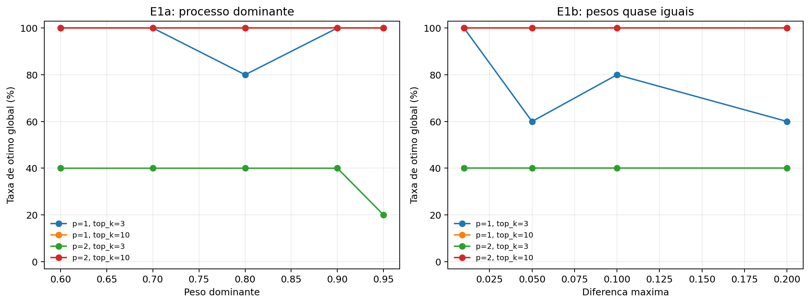
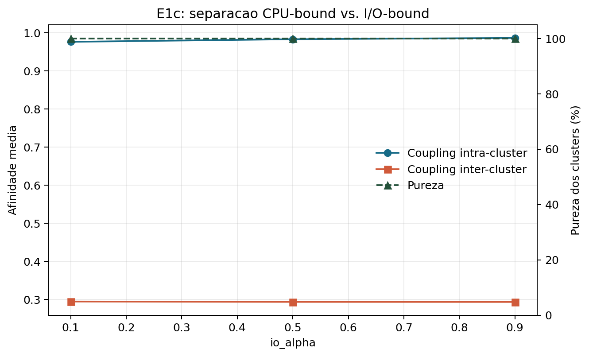
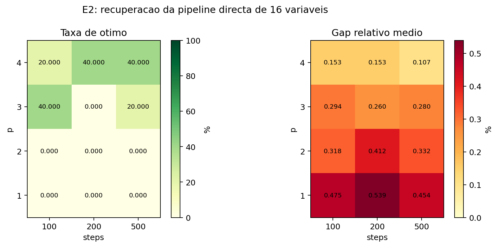
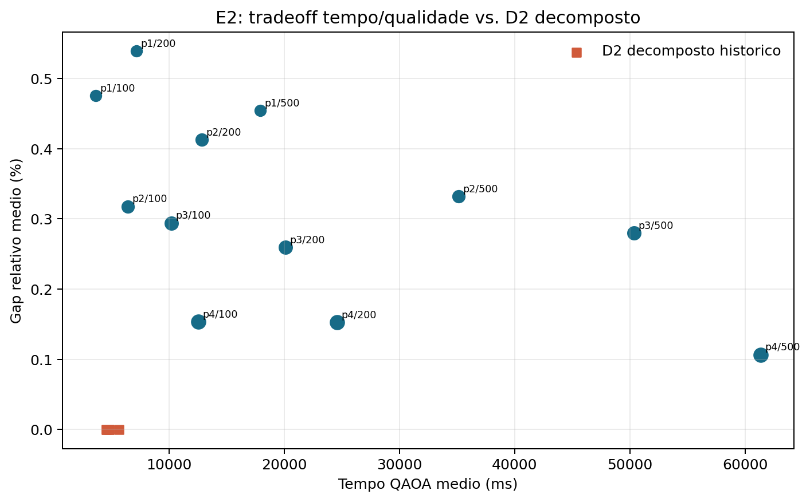
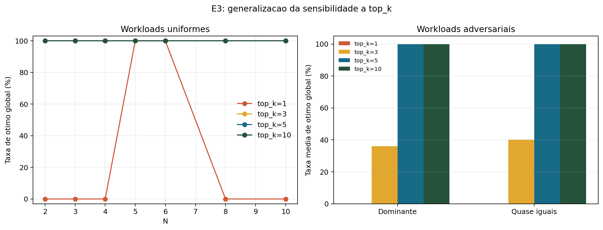
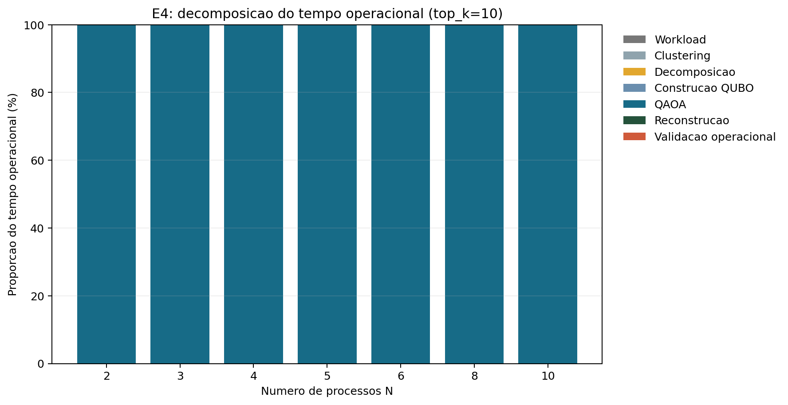

# Resultados finais da Fase 4: limites da pipeline híbrida

Data: 2026-06-28

## Resumo executivo

A Fase 4 acrescentou **530 runs** aos 434 das fases anteriores, elevando a base experimental para **964 runs principais**. Todos os 530 novos runs terminaram com sucesso e produziram atribuições one-hot viáveis. Como todas as instâncias desta fase tinham no máximo 20 variáveis, o brute-force foi usado como referência exata em 530/530 casos.

Com um critério estrito de igualdade energética, `abs(E - E*) <= 1e-9`, o QAOA atingiu o ótimo global em **374/530 runs (70,57%)**. O simulated annealing (SA) atingiu-o em **530/530 (100%)**. A redução face aos 97,69% das fases anteriores é intencional: esta fase substituiu benchmarks predominantemente regulares por workloads adversariais e orçamentos deliberadamente restritivos.

Os resultados sustentam quatro conclusões principais:

1. **A diversidade de candidatos é crítica.** Em workloads uniformes, `top_k>=3` atingiu 105/105 ótimos; nas adversariais, foi necessário `top_k>=5` para atingir 90/90.
2. **A decomposição teve vantagem estrutural na instância D2.** Os casos decompostos históricos atingiram 25/25 ótimos, enquanto a pipeline direta de 16 variáveis atingiu apenas 8/60 mesmo com até `p=4` e 500 passos.
3. **Mais profundidade não corrige automaticamente pouca diversidade.** Com `top_k=3`, `p=2` foi pior do que `p=1` nas duas famílias adversariais; com `top_k=10`, ambos atingiram 100%.
4. **O QAOA domina o tempo operacional medido.** Representou entre 99,979% e 99,991% do tempo da pipeline sintética de E4. Brute-force e SA foram contabilizados à parte como validação experimental.

Não existe evidência de vantagem quântica. O QAOA foi executado num simulador local e foi igualado ou superado pelo SA em todas as instâncias desta fase.

## Cobertura experimental

| Experiência | Objeto de estudo | Runs | Viáveis | QAOA ótimo | SA ótimo |
|---|---|---:|---:|---:|---:|
| E1a | Processo dominante | 100 | 100/100 | 83/100 | 100/100 |
| E1b | Pesos quase iguais | 80 | 80/80 | 63/80 | 80/80 |
| E1c | Clustering CPU-bound/I/O-bound | 60 | 60/60 | 60/60 | 60/60 |
| E2 | Orçamento direto, 16 variáveis | 60 | 60/60 | 8/60 | 60/60 |
| E3A | `top_k` adversarial adicional | 90 | 90/90 | 45/90 | 90/90 |
| E3U | `top_k` uniforme, N=2..10 | 140 | 140/140 | 115/140 | 140/140 |
| **Total** |  | **530** | **530/530** | **374/530** | **530/530** |

Cada configuração estocástica foi executada com as sementes 101, 102, 103, 104 e 105. O desenho inclui 240 runs em E1, 60 em E2 e 230 novos runs em E3. Os resultados de E1a/E1b com `p=2` também são reutilizados, sem nova contagem de runs, na comparação adversarial completa de E3.

## Critério de optimalidade e correção metodológica

Os JSONL originais classificaram 385 runs como ótimos através do `np.isclose` com tolerâncias por omissão. Essa tolerância era demasiado permissiva para os gaps muito pequenos de E1b e E2. A análise final recalculou a decisão diretamente pelas energias:

```text
ótimo estrito <=> abs(energia_QAOA - energia_brute_force) <= 1e-9
```

O total corrigido é 374, isto é, **11 runs deixaram de ser considerados exatamente ótimos**: três em E1b e oito em E2. As energias e gaps guardados não foram alterados. O validador foi atualizado para usar o mesmo critério em execuções futuras, e as tabelas preservam tanto `recorded_optimality_rate` como `optimality_rate` estrita para auditoria.

Esta correção não muda a viabilidade, os tempos, os valores de energia nem as tendências principais. Torna a conclusão sobre recuperação exata mais conservadora e cientificamente adequada.

## E1: instâncias adversariais

### E1a: processo dominante

Foram testados pesos dominantes de 0,60, 0,70, 0,80, 0,90 e 0,95, com cinco sementes para cada combinação de `p in {1,2}` e `top_k in {3,10}`.

| Profundidade | `top_k` | Runs | Ótimos | Taxa | Gap relativo médio | Gap máximo |
|---:|---:|---:|---:|---:|---:|---:|
| 1 | 3 | 25 | 24 | 96% | 0,00675% | 0,16887% |
| 1 | 10 | 25 | 25 | 100% | 0% | 0% |
| 2 | 3 | 25 | 9 | 36% | 0,08239% | 0,18146% |
| 2 | 10 | 25 | 25 | 100% | 0% | 0% |

Com `top_k=10`, todas as configurações foram resolvidas exatamente. Com `top_k=3`, a profundidade adicional degradou a taxa de ótimo de 96% para 36%. Logo, a dificuldade observada não é explicada apenas por profundidade insuficiente: existe uma interação entre a distribuição de probabilidade produzida pelo circuito, a otimização e o número de candidatos propagados entre sub-QUBOs.

**Resultado inesperado:** `p=2` foi consistentemente pior do que `p=1` quando a seleção ficou limitada a três candidatos. Não se deve concluir que circuitos mais profundos são intrinsecamente piores; conclui-se apenas que, neste algoritmo iterativo e neste orçamento, profundidade adicional não compensou um `top_k` restritivo.

### E1b: conflito de pesos quase iguais

Foram testadas quatro granularidades, com diferenças máximas de 0,01, 0,05, 0,10 e 0,20.

| Profundidade | `top_k` | Runs | Ótimos | Taxa | Gap relativo médio | Gap máximo |
|---:|---:|---:|---:|---:|---:|---:|
| 1 | 3 | 20 | 15 | 75% | 0,00321% | 0,02336% |
| 1 | 10 | 20 | 20 | 100% | 0% | 0% |
| 2 | 3 | 20 | 8 | 40% | 0,00571% | 0,02336% |
| 2 | 10 | 20 | 20 | 100% | 0% | 0% |

O padrão de E1a repete-se: a cobertura ampla elimina as falhas, enquanto `top_k=3` expõe sensibilidade e `p=2` não melhora a solução. Os gaps são pequenos porque muitas atribuições têm energia quase idêntica, mas a taxa de recuperação exata distingue os métodos.

As instâncias quase iguais mostram também por que é necessário separar “boa aproximação” de “ótimo certificado”. Um gap de ordem `1e-6` pode ser operacionalmente irrelevante, mas não deve ser contado como igualdade exata numa análise de optimalidade.

### E1c: clustering sintético

O snapshot tinha três processos CPU-bound e três I/O-bound. Em 60/60 runs, o clustering produziu exatamente dois bundles puros: os três CPU-bound num grupo e os três I/O-bound no outro.

| `io_alpha` | Pureza dos clusters | Coupling intra médio | Coupling inter médio | Load imbalance | QAOA ótimo |
|---:|---:|---:|---:|---:|---:|
| 0,1 | 100% | 0,9768 | 0,2946 | 0,5613 | 20/20 |
| 0,5 | 100% | 0,9768 | 0,2946 | 0,6465 | 20/20 |
| 0,9 | 100% | 0,9768 | 0,2946 | 0,7317 | 20/20 |

O coupling intra-cluster foi aproximadamente **3,32 vezes** o coupling inter-cluster, confirmando uma separação estrutural clara. Variar `io_alpha` não alterou a composição nesta amostra fortemente separada, mas aumentou o desequilíbrio de carga efetiva.

Este resultado estabelece uma distinção útil: **pureza de clustering não equivale a qualidade de scheduling**. O QAOA encontrou sempre o ótimo do QUBO construído sobre os bundles, mas bundles homogéneos e indivisíveis podem limitar o balanceamento global. Uma extensão natural é incorporar balanceabilidade ou limites de peso no critério de formação dos clusters.





## E2: orçamento QAOA na pipeline direta

E2 tentou recuperar a instância D2 de N=8, K=2 e 16 variáveis sem decomposição. Foram testadas 12 combinações de profundidade e passos, cada uma com cinco sementes.

| p | Passos | Ótimos | Taxa | Gap médio | Tempo médio |
|---:|---:|---:|---:|---:|---:|
| 1 | 100 | 0/5 | 0% | 0,4754% | 3,67 s |
| 1 | 200 | 0/5 | 0% | 0,5393% | 7,17 s |
| 1 | 500 | 0/5 | 0% | 0,4541% | 17,91 s |
| 2 | 100 | 0/5 | 0% | 0,3178% | 6,43 s |
| 2 | 200 | 0/5 | 0% | 0,4124% | 12,85 s |
| 2 | 500 | 0/5 | 0% | 0,3322% | 35,14 s |
| 3 | 100 | 2/5 | 40% | 0,2941% | 10,21 s |
| 3 | 200 | 0/5 | 0% | 0,2596% | 20,12 s |
| 3 | 500 | 1/5 | 20% | 0,2797% | 50,35 s |
| 4 | 100 | 1/5 | 20% | 0,1532% | 12,57 s |
| 4 | 200 | 2/5 | 40% | 0,1531% | 24,59 s |
| 4 | 500 | 2/5 | 40% | 0,1066% | 61,35 s |

O direto atingiu apenas **8/60 ótimos (13,33%)**. A profundidade reduziu o gap médio e aumentou a probabilidade de recuperação, mas nenhum ponto ultrapassou 40%. Aumentar apenas o número de passos não produziu uma melhoria monotónica: por exemplo, `p=3, steps=100` obteve 2/5 ótimos, mas `p=3, steps=200` obteve 0/5.

Nos resultados históricos de D2, os cinco valores decompostos `qubit_max in {4,6,8,10,12}` atingiram **25/25 ótimos**, com tempos médios entre 4,55 s e 5,65 s. O melhor gap médio direto foi obtido por `p=4, steps=500`, mas ainda só atingiu 2/5 ótimos e demorou 61,35 s: aproximadamente **13,5 vezes** o tempo do caso decomposto com `qubit_max=6`.

**Conclusão certificada dentro deste espaço experimental:** a pipeline direta não recuperou de forma fiável o ótimo, mesmo com muito mais orçamento. A decomposição não foi apenas uma adaptação a menos qubits; funcionou como uma estratégia de otimização que tornou esta instância mais fácil para o QAOA simulado.





## E3: generalização da sensibilidade a `top_k`

### Workloads uniformes

| N | `top_k=1` | Gap de `top_k=1` | Load imbalance | `top_k in {3,5,10}` |
|---:|---:|---:|---:|---:|
| 2 | 0/5 | 4,7619% | 1,00 | 15/15 ótimos |
| 3 | 0/5 | 2,8777% | 1,00 | 15/15 ótimos |
| 4 | 0/5 | 0,6098% | 0,50 | 15/15 ótimos |
| 5 | 5/5 | 0% | 0,20 | 15/15 ótimos |
| 6 | 5/5 | 0% | 0,00 | 15/15 ótimos |
| 8 | 0/5 | 0,0772% | 0,25 | 15/15 ótimos |
| 10 | 0/5 | 0,0396% | 0,20 | 15/15 ótimos |

`top_k=1` atingiu 10/35 ótimos (28,57%); cada um dos valores 3, 5 e 10 atingiu 35/35. A degradação **não foi monotónica com N**: o método falhou em N=2, 3 e 4, recuperou em N=5 e 6, e voltou a falhar em N=8 e 10. O pior gap relativo de toda a fase ocorreu em N=2 uniforme, não numa instância adversarial maior.

### Workloads adversariais

Para isolar o efeito de `top_k`, a comparação adversarial usa `p=2` em nove instâncias: cinco dominantes e quatro quase iguais.

| Estrutura | `top_k=1` | `top_k=3` | `top_k=5` | `top_k=10` |
|---|---:|---:|---:|---:|
| Dominante | 0/25 | 9/25 | 25/25 | 25/25 |
| Quase iguais | 0/20 | 8/20 | 20/20 | 20/20 |
| **Total** | **0/45** | **17/45** | **45/45** | **45/45** |

O efeito de `top_k=1` generaliza-se: falhou em todas as workloads adversariais. Contudo, a amplificação não aparece da mesma forma em todas as métricas. O gap médio com `top_k=1` foi cerca de 0,572% nas adversariais e 1,195% nas uniformes; o que piorou nas adversariais foi a **probabilidade de recuperação exata** (0% contra 28,57%), não a magnitude média do gap.

O limiar observado depende da workload: `top_k=3` foi suficiente para 100% nas uniformes, mas apenas 37,78% nas adversariais. `top_k>=5` atingiu 100% nas duas famílias testadas.



## E4: decomposição do tempo

E4 instrumentou o caminho iterativo das sete dimensões uniformes com `top_k=10`. O tempo de brute-force e SA foi retirado da validação operacional e apresentado como baseline experimental separado.

| N | Variáveis | QAOA | Total operacional | Proporção QAOA | BF + SA |
|---:|---:|---:|---:|---:|---:|
| 2 | 4 | 865,9 ms | 866,1 ms | 99,979% | 119,5 ms |
| 3 | 6 | 1304,4 ms | 1304,6 ms | 99,983% | 207,5 ms |
| 4 | 8 | 2405,5 ms | 2405,8 ms | 99,989% | 204,0 ms |
| 5 | 10 | 2770,5 ms | 2770,8 ms | 99,989% | 339,6 ms |
| 6 | 12 | 3336,1 ms | 3336,4 ms | 99,991% | 388,7 ms |
| 8 | 16 | 4145,8 ms | 4146,3 ms | 99,990% | 2098,7 ms |
| 10 | 20 | 5579,9 ms | 5580,4 ms | 99,991% | 32026,9 ms |

Construção da workload, decomposição, construção QUBO, reconstrução e validação operacional somaram menos de 0,021% do tempo em todas estas execuções. Assim, no simulador e no caminho sintético medido, o gargalo operacional é inequivocamente a execução QAOA.

O brute-force cresce para 32 s em N=10 e domina a duração total da experiência, mas não pertence à pipeline de produção; serve apenas para certificar o resultado. Os números medidos são específicos da implementação e máquina locais e não estimam a latência de hardware quântico real.



## Avaliação da hipótese reformulada

> Em instâncias adversariais, o QAOA com orçamento fixo degrada com o tamanho do problema; a decomposição mitiga essa degradação, mas o efeito depende conjuntamente de `qubit_max`, `top_k` e profundidade p.

1. **“O gap cresce com N” — não suportado.** No sweep uniforme com orçamento fixo, `top_k=1` falhou de forma não monotónica e teve os maiores gaps nas menores dimensões. As adversariais testadas usam N fixo por família e não estabelecem uma tendência dimensional.
2. **“A decomposição mitiga a degradação” — fortemente suportado para D2.** Os casos decompostos atingiram 25/25 ótimos, contra 8/60 no direto alargado e 0/5 no direto histórico.
3. **“O efeito é conjunto” — suportado.** `top_k=10` anulou a diferença entre `p=1` e `p=2` em E1; `top_k=3` expôs uma degradação forte em `p=2`; e aumentar `qubit_max` até eliminar a decomposição exigiu um orçamento QAOA muito maior sem recuperar fiabilidade.

A formulação final mais fiel aos dados é:

> A qualidade da pipeline iterativa não é função monotónica da dimensão, da profundidade ou do número de qubits isoladamente. No domínio testado, depende sobretudo da interação entre a dificuldade da workload, a granularidade da decomposição e a diversidade de candidatos propagados. A decomposição pode melhorar simultaneamente qualidade e tempo quando o QAOA direto não otimiza de forma fiável a instância global.

## Contributos científicos defensáveis

1. **Mapa empírico do domínio de validade.** A pipeline preservou viabilidade em 964/964 runs acumulados, mas a recuperação exata caiu de 97,69% no regime anterior para 70,57% na Fase 4. Viabilidade e optimalidade são propriedades distintas.
2. **Limiar de diversidade dependente da workload.** `top_k>=3` foi suficiente nas uniformes; `top_k>=5` foi necessário nas adversariais testadas.
3. **Evidência de vantagem algorítmica da decomposição, não vantagem quântica.** Em D2, sub-QUBOs menores foram mais fáceis de otimizar do que o QUBO global e também mais rápidos do que o melhor orçamento direto.
4. **Separação entre pureza e balanceamento no clustering.** A separação CPU/I/O foi perfeita, mas o load imbalance aumentou com `io_alpha`, mostrando que afinidade local e objetivo global podem divergir.
5. **Caracterização do gargalo operacional.** Mais de 99,97% do tempo medido pertenceu ao QAOA simulado, enquanto o custo clássico operacional foi residual neste caminho.
6. **Correção do critério de certificação.** A adoção explícita de tolerância `1e-9` evitou contar 11 aproximações como ótimos exatos e tornou os resultados auditáveis.

## Recomendações práticas

- Usar `top_k>=5` como valor conservador quando a distribuição da workload é desconhecida; `top_k=3` só ficou validado para as uniformes testadas.
- Não aumentar profundidade ou passos isoladamente como resposta automática a uma solução subótima. Testar conjuntamente profundidade, inicialização, diversidade e decomposição.
- Preferir a pipeline decomposta para a instância D2 e configurações equivalentes até existir calibração direta que demonstre recuperação robusta.
- Manter SA e brute-force como baselines obrigatórios em investigação. Nesta fase, SA encontrou todos os ótimos que o QAOA procurou.
- Acrescentar ao clustering uma restrição de peso máximo por bundle ou uma métrica de balanceabilidade, além da afinidade CPU/I/O.
- Reportar sempre viabilidade, energia, gap, taxa de ótimo e critério numérico; nenhuma destas métricas substitui as restantes.

## Ameaças à validade

- Todas as execuções QAOA usam simulação PennyLane local, não hardware quântico.
- O estudo está limitado a K=2 e a no máximo 20 variáveis com certificado exato.
- Cinco sementes medem sensibilidade à inicialização, mas não substituem uma população maior de workloads independentes.
- As famílias adversariais são controladas e pequenas; não cobrem todas as distribuições de processos reais.
- A comparação D2 é forte para a instância estudada, mas não prova vantagem universal da decomposição.
- Os tempos são dependentes da máquina, da implementação e do simulador. A proporção elevada de QAOA não prevê diretamente a latência de hardware futuro.
- O clustering sintético tem separação CPU/I/O muito clara. Perfis sobrepostos podem produzir pureza e estabilidade diferentes.

## Artefactos e reprodução

Resultados agregados:

- `src/experiments/results/phase4/sweep_20260627_173015_a8b15101_results.jsonl` — E1, 240 runs;
- `src/experiments/results/phase4/sweep_20260627_173904_53bdbde0_results.jsonl` — E2, 60 runs;
- `src/experiments/results/phase4/sweep_20260627_180326_a1a3c8cb_results.jsonl` — E3, 230 runs.

Tabelas, manifesto e figuras estão em `src/experiments/results/phase4/analysis/`. A análise pode ser regenerada com:

```bash
uv run python src/experiments/phase4_analysis.py \
  src/experiments/results/phase4/sweep_20260627_173015_a8b15101_results.jsonl \
  src/experiments/results/phase4/sweep_20260627_173904_53bdbde0_results.jsonl \
  src/experiments/results/phase4/sweep_20260627_180326_a1a3c8cb_results.jsonl
```

